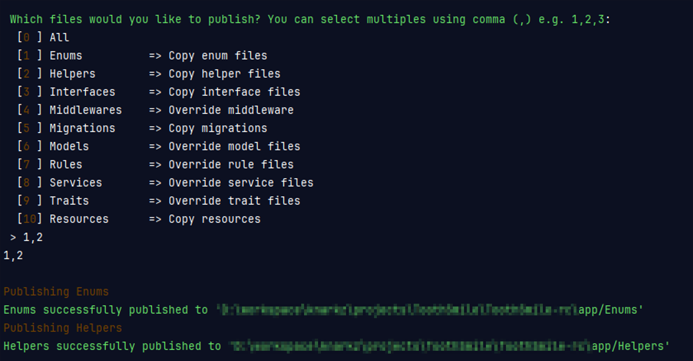

# <p align="center">Laravel Helping Material</p>

> This package is a collection of useful tools for Laravel developers. It includes helper functions for common tasks, enums for defining constants, helpful traits for models and controllers, laravel validation rules for custom validations, and a simple media upload library for handling file uploads. This package aims to make Laravel development easier and faster.

## Table of contents

- [Getting Started](#getting-started)
- [Prerequisites](#prerequisites)
- [Installation](#installation)
- [Publish](#publish)
- [Usage](#usage)
    - [Enums](#enums)
    - [Helpers](#helpers)
    - [Interface](#interface)
    - [Middleware](#middleware)
    - [Models](#models)
    - [Resources](#resources)
    - [Resources](#resources)
    - [Rules](#rules)
    - [Simple Media Library](#)
    - [Simple Media Library](#simple-media-library)
- [Contributing](#contributing)
- [Credits](#credits)
- [Built With](#built-with)
- [Versioning](#versioning)
- [Authors](#authors)
- [License](#license)

## Getting Started

This package offers a variety of features to enhance your web development experience. Some of the features are:

- Enums: Define and use enum types in your code for better readability and consistency.
- Helpers: Use handy functions and macros to simplify common tasks and operations.
- Colors Interface: Create and manipulate colors using a fluent and intuitive interface.
- Authorization Middleware: Protect your routes and controllers with customizable authorization logic.
- General Model: Use a base model class that provides common functionality and traits for your models.
- Helpful Css: Apply some useful css classes to your elements (if you are not using tailwind).
- Validation Rules: Validate your data with custom rules and messages.
- Some Helpful Traits: Use traits to add behavior and functionality to your classes, such as sluggable, sortable, filterable, etc.
- Simple Media Library: Manage your media files and attachments with ease.

This package is designed to help you with your web development projects. We hope you find it useful and enjoyable.

## Prerequisites

[(Back to top)](#table-of-contents)

This project requires PHP `(version 8.1 or later)` you can use [xampp](https://www.apachefriends.org/), [wamp](https://www.wampserver.com/en/), [laragon](https://laragon.org/index.html) or any other option that is suitable to you, they are really easy to install. To make sure you have them available on your machine, try running the following command.

```sh
$ php -v
8.1.6
```

## Installation

[(Back to top)](#table-of-contents)

Require this package with composer using the following command:

```sh
composer require abdullah-mateen/laravel-helping-metarial
```

## Publish

[(Back to top)](#table-of-contents)

You can use the publish command to publish all the files. This will allow you to modify the files as you wish. To publish your files, you need to execute this command in `PowerShell`, `cmd` or any other `terminal`.

```sh
php artisan lhm:publish
```

Once you run the above command it will display a menu of files to publish. You can select one or more files by typing their numbers separated by commas, as shown below:

[](./images/lhm-publish-selection.png)

## Usage

### Enums

[(Back to top)](#table-of-contents)

This package is using `php` default enums which are available from `(PHP 8 >= 8.1.0)` onward.

| Dir   | Enums                                         | Description                                                                                                                                                                    |
|-------|-----------------------------------------------|--------------------------------------------------------------------------------------------------------------------------------------------------------------------------------|
| Media | MediaDiskEnum<br/>MediaTypeEnum               | Both `enums` are related to `Media` model which is also included in this package.<br/>Mostly used in [`Simple Media Library`](#simple-media-library) which is documented below |
| User  | AccountStatusEnum<br/>GenderEnum<br/>RoleEnum | These enums are related to `User` model which are mostly/commonly used wherever there is a user                                                                                |
|       | StatusEnum                                    | General `Status` enum like to manage active/inactive statuses of a model                                                                                                       |

#### Example

```php
use \AbdullahMateen\LaravelHelpingMaterial\Enums\User\AccountStatusEnum;
use \AbdullahMateen\LaravelHelpingMaterial\Enums\User\GenderEnum;
use \AbdullahMateen\LaravelHelpingMaterial\Enums\User\RoleEnum;

class User extends Authenticatable {
    
    protected $casts = [
        'role'   => RoleEnum::class,
        'gender' => GenderEnum::class,
        'status' => AccountStatusEnum::class,
    ];
    
    // ...
}

User::create([
    'name'     => 'John Doe',
    'email'    => 'example@example.com',
    'password' => Hash::male('password'),
    'role'     => RoleEnum::Customer, // or you can use its value RoleEnum::Customer->value
    'gender'   => GenderEnum::Male, // or you can use its value GenderEnum::Male->value
    'status'   => AccountStatusEnum::Unverified, // or you can use its value AccountStatusEnum::Unverified->value
]);
```

> <span style="color: orange">**Note:** if you are going to use these enums as values then you don't need to cast them to enums.</span>

### Helpers

[(Back to top)](#table-of-contents)

<small style="color: #f00;font-weight: bold;">list of helper functions will be available soon.</small> For now you can have a look at available functions [here](https://github.com/AbdullahMateen/laravel-helping-metarial/tree/1.x/src/Helpers)

#### Example

```php
$user = auth_user();

$routeName = route_url_to_name('https://example.com') // will return 'index'

if (is_current_route('dashboard')) {
    // do something
}

// and much more ...
```

### Interface

[(Back to top)](#table-of-contents)

| Interface       | Description                                                                                                                                                                                          |
|-----------------|------------------------------------------------------------------------------------------------------------------------------------------------------------------------------------------------------|
| ColorsInterface | This interface contain a list of `color classes` and `color codes` of those classes for this you also need `sass` file which contain those classes.<br/>That `sass` file is included in this package |

#### Example

```php
use \AbdullahMateen\LaravelHelpingMaterial\Interfaces\ColorsInterface;
use \AbdullahMateen\LaravelHelpingMaterial\Enums\User\AccountStatusEnum;

class Example implements ColorsInterface {
    
    protected $casts = [
        'status' => AccountStatusEnum::class,
    ];
    
    public function getColorClass() {
        return 'bg-' . self::SUCCESS_CLASS // bg-success: for background colors
        // return self::SUCCESS_CLASS // success: for text colors
    }
    
    public function getColorCode() {
        return self::SUCCESS // #28a745
    }
    
    public function getStatusColor() {
        return $this->status->color(); // Using Enum 'color' function
    }
    
}
```

> you can see another examples in-use in Enums [here](https://github.com/AbdullahMateen/laravel-helping-metarial/tree/1.x/src/Helpers)

### Middleware

[(Back to top)](#table-of-contents)

| Middleware              | usage                      | Description                                                       |
|-------------------------|----------------------------|-------------------------------------------------------------------|
| AuthorizationMiddleware | `authorize:1001,3001,5001` | This middleware is used to authorize users based on their levels. |

#### Example

```php
// web.php File

use \AbdullahMateen\LaravelHelpingMaterial\Enums\User\RoleEnum;

Route::get('/dashboard', [DashboardController::class, 'index'])->middleware('authorize:1001,3001')

Route::get('/dashboard', [DashboardController::class, 'index'])->middleware('authorize:' . RoleEnum::column('value', 'admins', true))
```

> take a look at AuthorizationMiddleware [here](https://github.com/AbdullahMateen/laravel-helping-metarial/tree/1.x/src/Helpers)

### Models

[(Back to top)](#table-of-contents)

### Resources

[(Back to top)](#table-of-contents)

### Rules

[(Back to top)](#table-of-contents)

### Simple Media Library

[(Back to top)](#table-of-contents)

```js
useBasicFetch(url
:
string = '', delay
:
number = 0
)
```

Supported options and result fields for the `useBasicFetch` hook are listed below.

#### Options

`url`

| Type   | Default value |
|--------|---------------|
| string | ''            |

If present, the request will be performed as soon as the component is mounted

Example:

```tsx
const MyComponent: React.FC = () => {
    const {data, error, loading} = useBasicFetch('https://api.icndb.com/jokes/random');

    if (error) {
        return <p>Error</p>;
    }

    if (loading) {
        return <p>Loading...</p>;
    }

    return (
        <div className="App">
            <h2>Chuck Norris Joke of the day</h2>
            {data && data.value && <p>{data.value.joke}</p>}
        </div>
    );
};
```

`delay`

| Type   | Default value | Description          |
|--------|---------------|----------------------|
| number | 0             | Time in milliseconds |

If present, the request will be delayed by the given amount of time

Example:

```tsx
type Joke = {
    value: {
        id: number;
        joke: string;
    };
};

const MyComponent: React.FC = () => {
    const {data, error, loading} = useBasicFetch<Joke>('https://api.icndb.com/jokes/random', 2000);

    if (error) {
        return <p>Error</p>;
    }

    if (loading) {
        return <p>Loading...</p>;
    }

    return (
        <div className="App">
            <h2>Chuck Norris Joke of the day</h2>
            {data && data.value && <p>{data.value.joke}</p>}
        </div>
    );
};
```

### fetchData

```js
fetchData(url
:
string
)
```

Perform an asynchronous http request against a given url

```tsx
type Joke = {
    value: {
        id: number;
        joke: string;
    };
};

const ChuckNorrisJokes: React.FC = () => {
    const {data, fetchData, error, loading} = useBasicFetch<Joke>();
    const [jokeId, setJokeId] = useState(1);

    useEffect(() => {
        fetchData(`https://api.icndb.com/jokes/${jokeId}`);
    }, [jokeId, fetchData]);

    const handleNext = () => setJokeId(jokeId + 1);

    if (error) {
        return <p>Error</p>;
    }

    const jokeData = data && data.value;

    return (
        <div className="Comments">
            {loading && <p>Loading...</p>}
            {!loading && jokeData && (
                <div>
                    <p>Joke ID: {jokeData.id}</p>
                    <p>{jokeData.joke}</p>
                </div>
            )}
            {!loading && jokeData && !jokeData.joke && <p>{jokeData}</p>}
            <button disabled={loading} onClick={handleNext}>
                Next Joke
            </button>
        </div>
    );
};
```

## Contributing

Please read [CONTRIBUTING.md](CONTRIBUTING.md) for details on our code of conduct, and the process for submitting pull requests to us.

1. Fork it!
2. Create your feature branch: `git checkout -b my-new-feature`
3. Add your changes: `git add .`
4. Commit your changes: `git commit -am 'Add some feature'`
5. Push to the branch: `git push origin my-new-feature`
6. Submit a pull request :sunglasses:

## Credits

TODO: Write credits

## Built With

* Dropwizard - Bla bla bla
* Maven - Maybe
* Atom - ergaerga
* Love

## Versioning

We use [SemVer](http://semver.org/) for versioning. For the versions available, see the [tags on this repository](https://github.com/your/project/tags).

## Authors

* **John Doe** - *Initial work* - [JohnDoe](https://github.com/JohnDoe)

See also the list of [contributors](https://github.com/your/project/contributors) who participated in this project.

## License

[MIT License](https://andreasonny.mit-license.org/2019) © Andrea SonnY

# Color LS

[](http://forthebadge.com)
[](http://forthebadge.com)

[](https://badge.fury.io/rb/colorls)
[](https://github.com/athityakumar/colorls/actions/workflows/ruby.yml)
[](http://makeapullrequest.com)

A Ruby script that colorizes the `ls` output with color and icons. Here are the screenshots of working example on an iTerm2 terminal (Mac OS), `oh-my-zsh` with `powerlevel9k` theme and `powerline nerd-font + awesome-config` font with the `Solarized Dark` color theme.


*If you're interested in knowing the powerlevel9k configuration to get this prompt, have a look at [this gist](https://gist.github.com/athityakumar/1bd5e9e24cd2a1891565573a893993eb).*

# Table of contents

- [Usage](#usage)
    - [Flags](#flags)
        - `-1`
        - `-a`   (or) `--all`
        - `-A`   (or) `--almost-all`
        - `-d`   (or) `--dirs`
        - `-f`   (or) `--files`
        - `--help`
        - `-l`   (or) `--long`
        - `--report`
        - `--tree` (or) `--tree=[DEPTH]`
        - `--gs` (or) `--git-status`
        - `--sd` (or) `--sort-dirs` or `--group-directories-first`
        - `--sf` (or) `--sort-files`
        - `-t`
    - [Combination of flags](#combination-of-flags)
- [Installation](#installation)
- [Recommended configurations](#recommended-configurations)
- [Custom configurations](#custom-configurations)
- [Updating](#updating)
- [Uninstallation](#uninstallation)
- [Contributing](#contributing)
- [License](#license)

# Usage

[(Back to top)](#table-of-contents)

Man pages have been added. Checkout `man colorls`.

### Flags

- With `-1` : Lists one entry per line


- With `-a` (or) `--all` : Does not ignore entries starting with '.'


- With `-A` (or) `--almost-all` : Does not ignore entries starting with '.', except `./` and `../`


- With `-d` (or) `--dirs` : Shows only directories


- With `-f` (or) `--files` : Shows only files


- With `--help` : Prints a very helpful help menu


- With `-l` (or) `--long` : Shows in long listing format


- With `--report` : Shows brief report about number of files and folders shown


- With `--tree` (or) `--tree=[DEPTH]` : Shows tree view of the directory with the specified depth (default 3)


- With `--gs` (or) `--git-status` : Shows git status for each entry


- With `--sd` (or) `--sort-dirs` or `--group-directories-first` : Shows directories first, followed by files


- With `--sf` (or) `--sort-files` : Shows files first, followed by directories


- With `-t` : Sort by modification time, newest first (NEED TO ADD IMAGE)

- With color options : `--light` or `--dark` can be passed as a flag, to choose the appropriate color scheme. By default, the dark color scheme is chosen. In order to tweak any color, read [Custom configurations](#custom-configurations).

### Combination of flags

- Using `--gs` with `-t` :


- Using `--gs` with `-l` :


- Using `--sd` with `-l` and `-A` :


- Using `--non-human-readable` with `-l` :
    - This will print the file sizes in bytes (non-human readable format)

# Installation

[(Back to top)](#table-of-contents)

1. Install Ruby (preferably, version >= 2.6)
2. [Download](https://www.nerdfonts.com/font-downloads) and install a Nerd Font. Have a look at the [Nerd Font README](https://github.com/ryanoasis/nerd-fonts/blob/master/readme.md) for installation instructions.

   *Note for `iTerm2` users - Please enable the Nerd Font at iTerm2 > Preferences > Profiles > Text > Non-ASCII font > Hack Regular Nerd Font Complete.*

   *Note for `HyperJS` users - Please add `"Hack Nerd Font"` Font as an option to `fontFamily` in your `~/.hyper.js` file.*

3. Install the [colorls](https://rubygems.org/gems/colorls/) ruby gem with `gem install colorls`

   *Note for `rbenv` users - In case of load error when using `lc`, please try the below patch.*

    ```sh
    rbenv rehash
    rehash
    ```

4. Enable tab completion for flags by entering following line to your shell configuration file (`~/.bashrc` or `~/.zshrc`) :
    ```bash
    source $(dirname $(gem which colorls))/tab_complete.sh
    ```

5. Start using `colorls` :tada:

6. Have a look at [Recommended configurations](#recommended-configurations) and [Custom configurations](#custom-configurations).

# Recommended configurations

[(Back to top)](#table-of-contents)

1. To add some short command (say, `lc`) with some flag options (say, `-l`, `-A`, `--sd`) by default, add this to your shell configuration file (`~/.bashrc`, `~/.zshrc`, etc.) :
    ```sh
    alias lc='colorls -lA --sd'
    ```

2. For changing the icon(s) to other unicode icons of choice (select icons from [here](https://nerdfonts.com/)), change the YAML files in a text editor of your choice (say, `subl`)

    ```sh
    subl $(dirname $(gem which colorls))/yaml
    ```

# Custom configurations

[(Back to top)](#table-of-contents)

You can overwrite the existing icons and colors mapping by copying the yaml files from `$(dirname $(gem which colorls))/yaml` into `~/.config/colorls`, and changing them.

- To overwrite color mapping :

  Please have a look at the [list of supported color names](https://github.com/sickill/rainbow#color-list). You may also use a color hex code as long as it is quoted within the YAML file and prefaced with a `#` symbol.

  Let's say that you're using the dark color scheme and would like to change the color of untracked file (`??`) in the `--git-status` flag to yellow. Copy the defaut `dark_colors.yaml` and change it.

  Check if the `~/.config/colorls` directory exists. If it doesn't exist, create it using the following command:

  ```sh
  mkdir -p ~/.config/colorls
  ```

  And then

  ```sh
  cp $(dirname $(gem which colorls))/yaml/dark_colors.yaml ~/.config/colorls/dark_colors.yaml
  ```

  In the `~/.config/colorls/dark_colors.yaml` file, change the color set for `untracked` from `darkorange` to `yellow`, and save the change.

  ```
  untracked: yellow
  ```

  Or, using hex color codes:

  ```
  untracked: '#FFFF00'
  ```

- To overwrite icon mapping :

  Please have a look at the [list of supported icons](https://nerdfonts.com/). Let's say you want to add an icon for swift files. Copy the default `files.yaml` and change it.

  ```sh
  cp $(dirname $(gem which colorls))/yaml/files.yaml ~/.config/colorls/files.yaml`
  ```

  In the `~/.config/colorls/files.yaml` file, add a new icon / change an existing icon, and save the change.

  ```
  swift: "\uF179"
  ```

- User contributed alias configurations :

    - [@rjhilgefort](https://gist.github.com/rjhilgefort/51ea47dd91bcd90cd6d9b3b199188c16)

# Updating

[(Back to top)](#table-of-contents)

Want to update to the latest version of `colorls`?

```sh
gem update colorls
```

# Uninstallation

[(Back to top)](#table-of-contents)

Want to uninstall and revert back to the old style? No issues (sob). Please feel free to open an issue regarding how we can enhance `colorls`.

```sh
gem uninstall colorls
```

# Contributing

[(Back to top)](#table-of-contents)

Your contributions are always welcome! Please have a look at the [contribution guidelines](CONTRIBUTING.md) first. :tada:

# License

[(Back to top)](#table-of-contents)

The MIT License (MIT) 2017 - [Athitya Kumar](https://github.com/athityakumar/). Please have a look at the [LICENSE.md](LICENSE.md) for more details.
